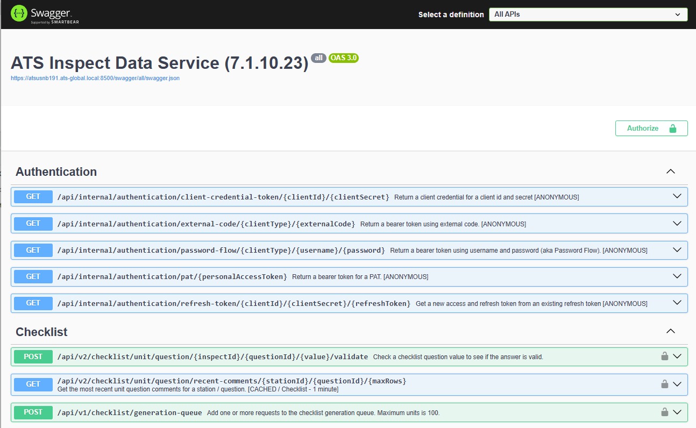

# ATS Inspect

This repository is designed to give third-parties information on how to interact with ATS Inspect services and applications.

It assumes that the user has some familiarity with Inspect. If not, a good starting point can be found here: [ATS Inspect Help](https://ats-help.com/inspect/#t=Home.htm).

ATS Security is an important part of the ATS ADOS ecosystem. For documentation, go here: [ATS Security](https://ats-help.com/security-configuration/#t=Home.htm). It is used to manage users, roles, personal access tokens and more.

All projects are written in C# and utilize the NET 9 SDK.

More information about Inspect can be found here: [ATS Inspect](https://ats-global.com/ats-inspect).

You can get a full list of APIs by navigating to your Data Service [Swagger](https://en.wikipedia.org/wiki/Swagger_(software)) endpoint (example: https://your-data-service-url:8500/swagger).

> [!IMPORTANT]
You must have ATS Security Manager, ATS Inspect Data Service and ATS Inspect Travel Service installed in order for these demos to work.

There are three projects:

### DemoApiClient
Demonstrates making API calls against our Data Service.
If performs the following API calls:
* Gets a personal access token
* Gets the info for a station (aka 'collector').
* Gets a unit id for a unit identifier type + identifier
* Gets defect statistics (summary) for the unit
* If there are open (not repaired) defects, prints a travel ticket

### DemoWebhookClient
Demonstrates consuming webhook messages from Data Service.
To exercise this client, you will need to register a webhook. The easiest way to do this is to use the built-in Swagger interface for Data Service.
To register a webhook, you will need to:
* Start the webhook client (DemoWebhookClient)
* [Get a bearer token](doc-resources/get-access-token.md)
* Register a webhook

When you register the webhook, you will start to receive webhook messages of the type you registered for.

### DemoCustomControl
Demonstrates creating a WinForms UserControl that can be registered via Form Composer and consumed within Data Collect. This allows extending the functionality of Data Collect in a clean and powerful way.