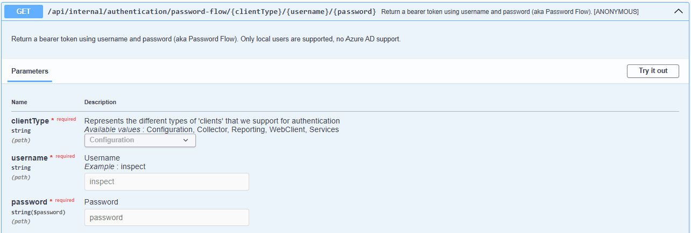
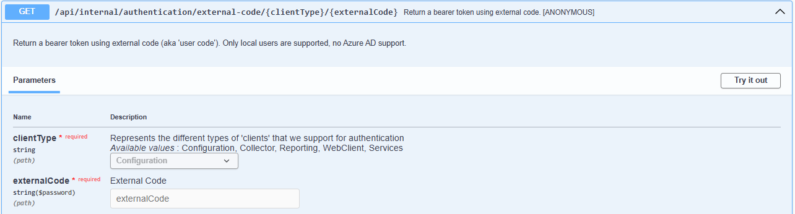
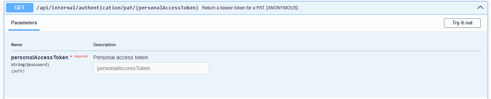
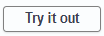
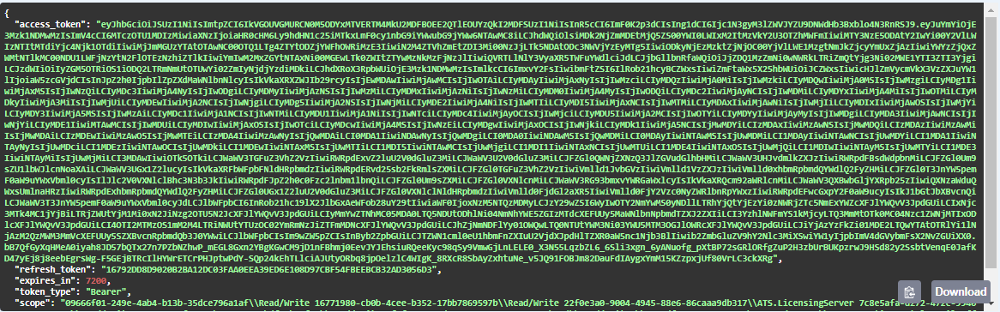
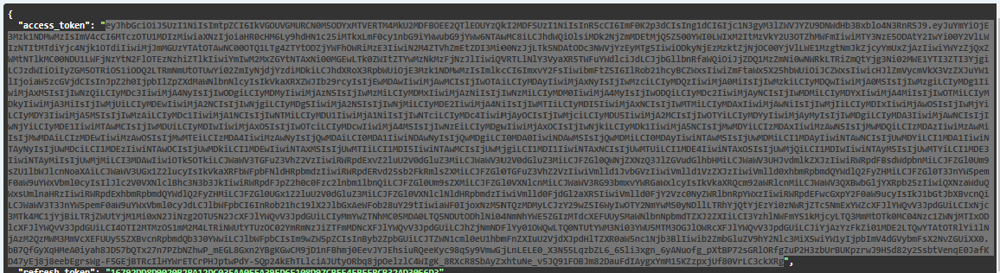
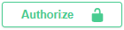

# Obtaining a Bearer Token
There are three ways of getting an access token, password flow (username + password), external code (aka 'user code') and personal access token.

## Username + Password

## External Code

## Personal Access Token

Regardless of which method you use, pick one and click on "Try it out":

Choose either "Configuration" or "Collector" for the clientType.
Fill in any other required info and click on "Execute":

If your information is correct, you should get a "200" response and see content similar to the following:

You then need to copy the data for the "access_token". In the example displayed, this means you need to copy everything inside the quotation marks to the right of the "access_token" tag:

Then go to the top of the Swagger page and click on the "Authorize" button:
  

Then simply paste in the contents of the copied access token and click "Authorize".

**You are now authenticated and can call other APIs!**

